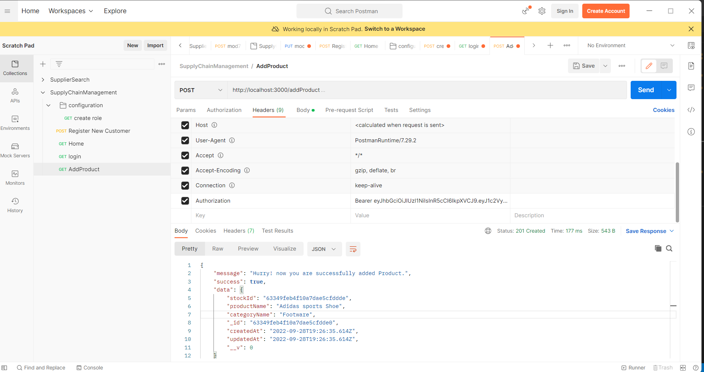

# Supply Chain Management System using Nodejs and Mongo DB 

In this project, you will walk theough creating an API using [Node js](https://nodejs.org/en/docs/) and Mongo DB.
If you have any questions throughout the procedure. feel free to reach out.

## Part 1 - Prerequisistes - Set up the account in mongoDB atlas and installations(node and npm).

To start with, you need to setup account in mongoDB atlas
### Step1 - mongoDB Atlas
We will be using mongoDB atals for the project as it provides free tier. It provides a cluster of database and handles any downtime issues for us.
[Sign up for free account](https://www.mongodb.com/cloud/atlas/signup?utm_content=rlsapostreg&utm_source=google&utm_campaign=search_gs_pl_evergreen_atlas_general_retarget-brand-postreg_gic-null_amers-us-ca_ps-all_desktop_eng_lead&utm_term=&utm_medium=cpc_paid_search&utm_ad=&utm_ad_campaign_id=14383025495&adgroup=129270225274&gclid=CjwKCAjw4c-ZBhAEEiwAZ105RSrPGJ1z9z6GBRUOrPw-DD8vYkxSP091du-xhQjCroMaiC07wLNw8BoC2IAQAvD_BwE)

once you register yourself, sign in and  create project and database then choose free tier which is **MO cluster** and it is sandbox environment . You will get an option to use GCP or AWS or any other hosting services to where you want host your database.

Once you are able to access mongoDB there is an option to know your connection string - go to database under deployment in the left menu and click on connect and select conenct to your Application then you should be able to see similar screen as below



we will be using the connection string when we set up out node project
### Step2 - install node and npm 
to know whether you have npm installed
npm --version
for node : node --version - should be above v8.0.0 as most of the services are compatible with lower versions -[try upgrading npm](https://docs.npmjs.com/try-the-latest-stable-version-of-npm)
if you are able to see version number then proceed to the next steps
If you do not have npm and node installed in your project then follow [npm and node installation guide](https://docs.npmjs.com/downloading-and-installing-node-js-and-npm)

### Step 3 - install postman
We need postman to test our API endpoints once the development is done. [Download postman](https://learning.postman.com/docs/getting-started/installation-and-updates/)

## Part 2 - Set up node project

There are 2 options - you can clone the code from github resposity from [here](https://github.com/sravanthi-reddy/supply-chain-management/tree/master)
or follow the following steps to set up the project from **scratch**. Skip to Part 3 if you would like to clone the repositoy
### Step 1 - Initialize the project
Please go ahead download vscode of you do not have one - [Download VScode](https://code.visualstudio.com/docs/setup/setup-overview)

open command prompt where you want to create the project and create directory using following commands and open 
```
mkdir supply-chain-management
cd supply-chain-management
```
Now that we are inside the project folder run `code .` it opens VS code for that directory

once you are in VScode open termial under VScode (**at bottom left traingle symbols it opens a seperate tab where you will be seeing terminal option**)

run `npm init` under the supply-chain-managemet directory
**it should create package.json file**

### Step 2 - Dependencies installation
we nee setof libraries to implement our project. we will go ahead and run npm commands to install those
`npm install express`  Express in node js web application framewrok which provides broad range of features to run our application
and we also need other dependencies. We will talk about why we need those in the development process. For now please go ahead and isntall the following dependencies
 ```
 npm install body-parser  passport passport-jwt jwt bcryptjs cors dotenv mongoose
 ```
 once the isntallation is done. You can get the code files and folders from repository and paste it in your application


## Part 3 - Connect your app to Database

Since you have choose to clone the repository - please run `npm install` command, Which installs all prerequisite projects based on the  `package-lock.json file`
create `.env` file under root directory of the project and paste the following code
```
PORT=3000
DB_USER = # add your user db user name
DB_PASS = # add password here
ADMIN_PASS = ""
SUPP_PASS = ""
SECRET= # add any secret key - we need this for setting up jwt


```
now go `index.js` file under root directory and replace the `dbRoute` variable value with your connection string from mongo DB. and set up your username and password according to the previous dbroute.
If you remeber about **connection string from part 1** - copy the connection string from mongo DB atals

By now your project structure should look like below 

//ADD PROJECT STRUCURE IMAGE HERE

Now run `npm start` then it should display the following message in the command prompt

```

> supply-chain-management@1.0.0 start
> nodemon ./index.js

[nodemon] 2.0.20
[nodemon] to restart at any time, enter `rs`
[nodemon] watching path(s): *.*
[nodemon] watching extensions: js,mjs,json
[nodemon] starting `node ./index.js`
hitting token
Server is running on port: 3000
MongoDB database connection established successfully

```


## part 4 - Seeding the data

Since we are in Milestone2 of the project. We are focusing more on CRUD operations and we need some default data to develop the application
Please refer to `seedData.js` file to understand what data we are seeding.

**Your project should be up and runnign through out the seeding process**
Open your postman and create a seeding request. If open `routes.js` under routes directory you will be seeing endpoint to see the data `/seedData`
Once you open your postman hit a post request to the following url
'''
http://localhost:3000/seeData
'''
You can change the seeding data under `configureData()` method in seedData.js file. Once the request is successfull, you should see the following message there

'''
{
  message: `successfully populated the data.`,
        success: true
}
'''

Then you should be able to see success response from the app to the postman. As below
// ADD postman seed data image as below


## Part 5 - hitting different end points 
If  open `routes.js` file under routes directory. You will be seeing lsit of endpoints 
```


router.get('/seedData',configureData)
router.get("/login",login)
router.post("/registerCustomer",registerUser)
router.get("/",home)


//Product CRUD
router.put("/updateProduct",userAuth,checkPermission("updateProduct"),updateProductInfo)
router.delete("/deleteProduct",userAuth,checkPermission("deleteProduct"),deleteProductById)
router.post("/addProduct",userAuth,checkPermission("addProduct"), addProduct)
router.get("/ViewProduct",userAuth,checkPermission("ViewProduct"),viewProductById)
router.get("/ViewAllProducts",userAuth,checkPermission("ViewAllProducts"),viewAllProductsInfo)

//Supplier
router.get("/ViewAllSupplier",userAuth,viewAllSupplierInfo)

//Order related enpoints
router.post("/placeCustomerOrder",userAuth,placeCustomerOrder)
router.get("/trackCustomerOrder",userAuth,trackCustomerOrder)

router.post("/placeStockOrder",userAuth,placeStockOrder)
router.get("/trackStockOrder",userAuth,trackStockOrder)

```

to hit `registerCustomer` url - we need to pass  data- setelect Body- raw - Json and paster your data
sample data
```
{
   "name": "sravanthi",
  "email": "sravanthi@gmail.com",
  "phoneNumber": 123456789,
  "addressLine1": "123 Abc street",
  "province": "Ontario",
  "city": "Xyz" ,
  "postalCode": "A1B2C3"
}
```

and user should be able to register successfully.

// add register post man screen 


## Part 6 - Security of application  - creating jwt tokens
Creating jwt token on login, will sign the token on sign in and verify the token for further request. if it is not the same user then will respond with **UnAuthorized** message
`login`

/ add login image

`/addProduct` - without token
//add unauthorized error

`addProduct` with token 


## Part 7 - RBAC - Role Based Access Control

while generating token we are adding payload which includes - userId , roleId and email of the user. While verifying request we will be able to get that information using **passport package**.
refere to the code in ** middlewares/passport.js** to understand how we are able to get the information back from jwt token
In the database while seeding the data, we have generated **permissions for each role**. Using roleId from jwt token we will then get permissions and keep in the request object so that whenever user hits an endpoint, we can verify whether the role of that user is having permission to access particular end points
**Permssions in the database for admin**

// add permission data from database here

**Login as a customer and trying to add Product in the database. which is not recommended and application should return unauthorized for such actions**

`/login` as a customer

// add login customer image

`/addProduct being in customer session`

// add unauthorized to access url


Congratuations, Finally you are able to setup your node project and hit the end points


